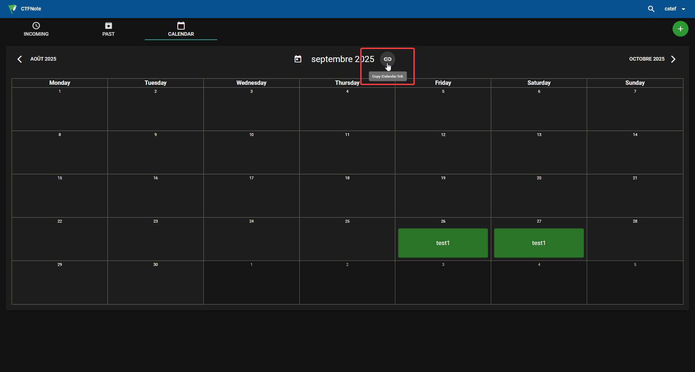

<p align="center">
    
    
</p>

--- 

Source code of the [yctf.ch](https://yctf.ch) website.

## Writing Content

The file structure is as follows:

```
content/
├── data/
    └── events.toml
├── pages/
│   └── ...
└── writeups/
    ├── <ctf-name>/
    │   └── <challenge-name>/
    │       ├── index.md
    │       └── files/
    │           ├── <files>
    │           └── ...
    └── ...
```

### Pages

Mostly static pages like the home page, about page, etc. are stored in the [`content/pages/`](content/pages/) directory.

### Writeups

Writeups are stored in the [`content/writeups/`](content/writeups) directory as a **git submodule** pointing to the [writeups repository](https://github.com/y-ctf/writeups).

For contributing writeups, see the [writeups README](content/writeups/README.md).

To quickly get started with a new writeup, you can use the CLI tool:

```bash
uv run scripts/cli.py writeups new
```

This will prompt you for the required metadata and create a new writeup template in the appropriate directory.

### Events

Events are stored in the [`content/data/events.toml`](content/data/events.toml) file.

Example event entry:

```toml
[[events]]
title = { 
    en = "Event title in English", 
    fr = "Titre de l'event en français" 
}
description = { 
    en = "Brief description of the event", 
    fr = "Description brève de l'event" 
}
start_date = "2025-10-15T18:00:00+01:00"             # ISO 8601 format
end_date = "2025-10-15T20:00:00+01:00"               # ISO 8601 format
location = "Physical/Virtual location"
type = "competition"                                 # competition, meeting, conference, training, etc.
url = "https://example.com"                          # Optional external link, shown as "learn more"
registration_deadline = "2025-10-14T23:59:59+01:00"  # Optional deadline
```

To add events, you can either edit the `events.toml` file directly or use the import scripts described in the [Importing Content](#importing-content) section.

## Development

1. Clone the repository with submodules

```bash
git clone --recurse-submodules https://github.com/y-ctf/y-ctf.github.io.git
cd y-ctf.github.io
```

Or if you've already cloned without submodules:

```bash
git submodule update --init --recursive
```

2. Install Zola ([`brew`](https://brew.sh) or [`cargo`](https://rustup.rs))

```bash
brew install cestef/tap/zola
# or with cargo
cargo install --git https://github.com/cestef/zola
```

<small>You can also download a pre-built binary from the [releases page](https://github.com/cestef/zola/releases).</small>

3. Install dependencies ([`pnpm`](https://pnpm.io))

```bash
pnpm install
```

4. Start the development server

```bash
pnpm dev
```

## Importing Content

### Writeups from [CTFNote](https://note.yctf.ch)

You can import writeups from CTFNote using the CLI tool provided in this repository. Make sure you have Python or [`uv`](https://docs.astral.sh/uv/getting-started/installation/) installed.

```bash
# Import writeups for a specific CTF
uv run scripts/cli.py writeups import -c "<ctf-name>" -a "Bearer <API_TOKEN>"
```

<details>
<summary>How to retrieve the API token from CTFNote</summary>
<p></p>

Log in to your [CTFNote account](https://note.yctf.ch/#/auth/login), open the developer console in your browser, and run the following command to get your token:

```javascript
localStorage.getItem("JWT")
```

</details>

#### After importing

1. Commit and push changes in the writeups submodule:
   ```bash
   cd content/writeups
   git add .
   git commit -m "add writeups for <ctf-name>"
   git push
   ```

2. Update the submodule reference in the main repository:
   ```bash
   cd ../..
   git add content/writeups
   git commit -m "update writeups submodule"
   git push
   ```

### Events from an ICS Calendar

Events can be imported from ICS calendar files or URLs. To import events directly from CTFNote, you'll need the ICS URL and the iCalendar secret key.

<details>
<summary>How to retrieve the iCalendar URL from CTFNote</summary>
<p></p>



</details>

```bash
# Import from a URL
uv run scripts/cli.py events import -i "https://yctf.ch/calendar.ics?key=<CALENDAR_KEY>" --event-type "competition"

# Import from a local ICS file
uv run scripts/cli.py events import -i "path/to/calendar.ics"
```