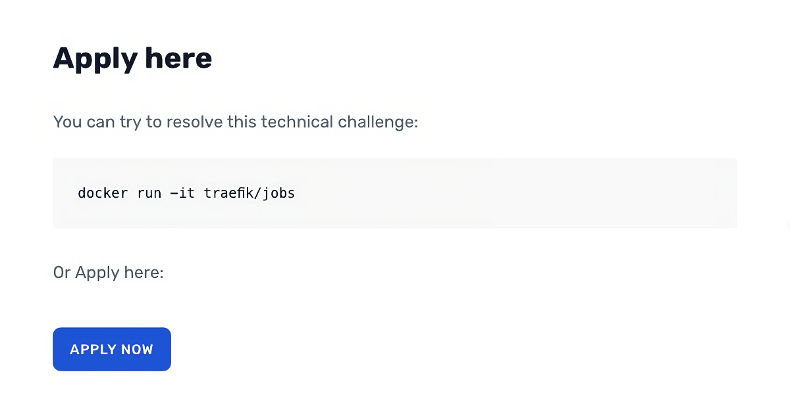
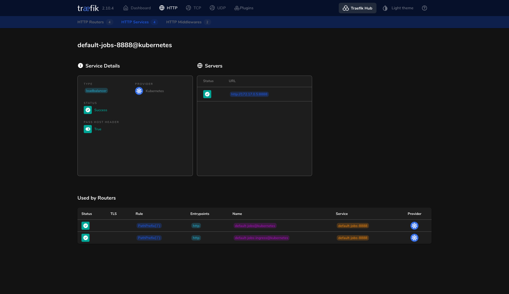
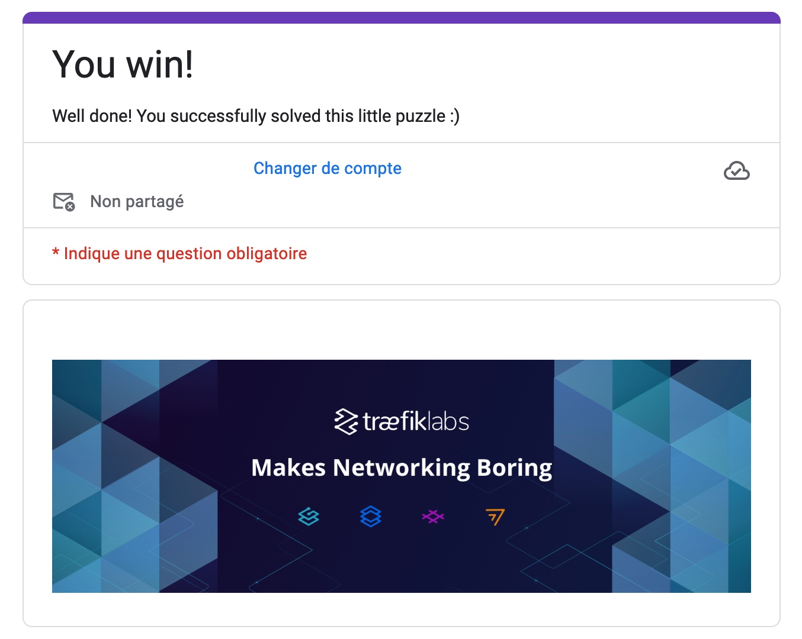

+++
title = "Oh, so you want to work at Traefik?"
description = "A pretty unusual way to apply for a developer job at Traefik..."
date = 2024-11-12
[taxonomies]
tags = ["ctf"]
+++


> [!WARNING]
> If you are using this article to solve the challenge, please make sure to not just copy-paste the commands, but to understand what they do.
>
> My goal is to allow you to learn something new, not to give you the solution on a silver platter 😉

## Introduction

When looking for an alternative to [HAProxy](https://www.haproxy.org/) or [Nginx](https://www.nginx.com/),
I came across [Traefik](https://traefik.io/), a modern HTTP reverse proxy and load balancer made to deploy microservices with ease,
even featuring [Kubernetes](https://kubernetes.io/) Ingress support, or [Let's Encrypt](https://letsencrypt.org/) integration.

By digging a little more on their website, I found a [developer job application form](https://traefik.io/careers/developers-systems-engineers).
I was surprised to see that there was no traditional CV to send, but a docker command to run.

[](./images/traefik-docker.png)

## The challenge

Spun up the image as requested, I was greeted with a nice error message:

```
$ docker run -it traefik/jobs
Helmsman, where are you? 🤔
```

I immediately thought of [Helm](https://helm.sh/), the package manager for Kubernetes, so I went ahead and started a `minikube` cluster.

```bash,copy
minikube start --kubernetes-version=v1.19
```

_**Note:** I used the `v1.19` version of Kubernetes because it was the latest available at the time of the last update of the Docker image. (see the [version list](https://www.knowledgehut.com/blog/devops/kubernetes-versions#different-versions-of-kubernetes))_

And then started a pod with the image.

```bash,copy
kubectl run traefik-jobs -it --image=traefik/jobs --restart=Never
```

Still getting an error message, but this time it was different:

```
It seems I do need more permissions... May I be promoted cluster-admin? 🙏
Hmmmm, it seems Helmsman deployment has an issue 😒
```

I was now sure that I was on the right track.

The image was kindly asking us to give it more permissions, so I naturally gave it the `cluster-admin` role.
(I know, I know, it's not a good practice, but it's just for a CTF, right?)

```yaml,copy
# service-account.yml

---
apiVersion: v1
kind: ServiceAccount
metadata:
    name: traefik-jobs
---
apiVersion: rbac.authorization.k8s.io/v1
kind: ClusterRoleBinding
metadata:
    name: traefik-jobs-admin
subjects:
    - kind: ServiceAccount
      name: traefik-jobs
      namespace: default
roleRef:
    kind: ClusterRole
    name: cluster-admin
    apiGroup: rbac.authorization.k8s.io
```

Applying the created manifest.

```bash,copy
kubectl apply -f service-account.yml
```

We now have a service account with the `cluster-admin` role, so let's set it to the pod.

```yaml,copy
# pod.yml

---
apiVersion: apps/v1
kind: Deployment
metadata:
    name: jobs
    labels:
        app: jobs
spec:
    selector:
        matchLabels:
            app: jobs
    template:
        metadata:
            labels:
                app: jobs
        spec:
            serviceAccount: traefik-jobs
            serviceAccountName: traefik-jobs
            containers:
                - name: jobs
                  image: traefik/jobs
```

```bash,copy
kubectl apply -f pod.yml
```

We have a pod running with the `cluster-admin` role, so we should be able to take a look at the logs.

```bash,copy
kubectl logs deployments/jobs
```

```
Look at me by the 8888 ingress 🚪
```

Setting up an ingress on port `8888` should do the trick.

```yaml,copy 
# ingress.yml

---
apiVersion: v1
kind: Service
metadata:
    name: jobs
spec:
    selector:
        app: jobs
    ports:
        - protocol: TCP
          port: 8888
          targetPort: 8888
---
apiVersion: networking.k8s.io/v1
kind: Ingress
metadata:
    name: jobs
spec:
    rules:
        - http:
              paths:
                  - path: /
                    pathType: Prefix
                    backend:
                        service:
                            name: jobs
                            port:
                                number: 8888
```

```bash,copy
kubectl apply -f ingress.yml
```

And restarting the pod.

```bash,copy
kubectl rollout restart deployment jobs
```

The logs now say:

```
You have set up your cluster in good taste 😉
Now that you have set up an ingress... You should be able find me...
```

It should now be as simple as port-forwarding the ingress to our local machine.

```bash,copy
kubectl port-forward deployments/jobs 8888:8888
```

And then, we can access the pod on [`localhost:8888`](http://localhost:8888).

```
Come on, use that damn ingress please 😬
```

I see what you did there, Traefik 😏.

As Traefik provides an ingress controller for Kubernetes, I think it's safe to assume that they want us to use it.

Well, well, well... Let's create a Traefik Proxy. I followed the [quick-start guide](https://doc.traefik.io/traefik/getting-started/quick-start-with-kubernetes/) from the documentation.

Various resources are created:

```yaml,copy
# traefik/00-role.yml

kind: ClusterRole
apiVersion: rbac.authorization.k8s.io/v1
metadata:
    name: traefik-role

rules:
    - apiGroups:
          - ""
      resources:
          - services
          - endpoints
          - secrets
      verbs:
          - get
          - list
          - watch
    - apiGroups:
          - extensions
          - networking.k8s.io
      resources:
          - ingresses
          - ingressclasses
      verbs:
          - get
          - list
          - watch
    - apiGroups:
          - extensions
          - networking.k8s.io
      resources:
          - ingresses/status
      verbs:
          - update
```

```yaml,copy
# traefik/00-account.yml

apiVersion: v1
kind: ServiceAccount
metadata:
    name: traefik-account
```

```yaml,copy
# traefik/01-role-binding.yml

kind: ClusterRoleBinding
apiVersion: rbac.authorization.k8s.io/v1
metadata:
    name: traefik-role-binding

roleRef:
    apiGroup: rbac.authorization.k8s.io
    kind: ClusterRole
    name: traefik-role
subjects:
    - kind: ServiceAccount
      name: traefik-account
      namespace: default
```

The Traefik deployment itself:

```yaml,copy
# traefik/02-traefik.yml

kind: Deployment
apiVersion: apps/v1
metadata:
    name: traefik-deployment
    labels:
        app: traefik

spec:
    replicas: 1
    selector:
        matchLabels:
            app: traefik
    template:
        metadata:
            labels:
                app: traefik
        spec:
            serviceAccountName: traefik-account
            containers:
                - name: traefik
                  image: traefik:v2.10
                  args:
                      - --api.insecure
                      - --providers.kubernetesingress
                  ports:
                      - name: web
                        containerPort: 80
                      - name: dashboard
                        containerPort: 8080
```

And finally, the service:

```yaml,copy
# traefik/02-traefik-services.yml

apiVersion: v1
kind: Service
metadata:
    name: traefik-dashboard-service

spec:
    type: LoadBalancer
    ports:
        - port: 8080
          targetPort: dashboard
    selector:
        app: traefik
---
apiVersion: v1
kind: Service
metadata:
    name: traefik-web-service

spec:
    type: LoadBalancer
    ports:
        - targetPort: web
          port: 80
    selector:
        app: traefik
```

Applying the manifests.

```bash,copy
kubectl apply -f 00-role.yml \
              -f 00-account.yml \
              -f 01-role-binding.yml \
              -f 02-traefik.yml \
              -f 02-traefik-services.yml
```

We now have a Traefik proxy running on our cluster, and as Traefik relies on ingress resources, our pod should be directly accessible via the proxy.

```bash,copy
kubectl port-forward deployments/traefik-deployment 8080:8080
```

The HTTP Service for our pod is effectively listed in the dashboard:

[](./images/traefik-dashboard.png)

Forwarding the proxy port to something fancy:

```bash,copy
kubectl port-forward deployments/traefik-deployment 1337:80
```

Visiting [`localhost:1337`](http://localhost:1337):

```
I have to tell you something...
Something that nobody should know.
However, everyone could see it.
It's even part of my public image.
Come back when you know more.
But remember, it's a secret 🤫
```

The message is a bit cryptic, but it seems that we have to find something in the image.

Running `docker inspect` on the image, we get a ton of information:

```bash,copy
docker inspect traefik/jobs
```

```json
{
	"Id": "sha256:...",
	"RepoTags": ["traefik/jobs:latest"],
	"Comment": "buildkit.dockerfile.v0",
	"Created": "2020-10-22T13:50:23.922043068Z",
	"Config": {
		// ...
		"WorkingDir": "/",
		"Entrypoint": ["/start"],
		"Labels": {
			"helmsman": "dcc9c530767c102764d45d621fc92317"
		}
	},
	"Architecture": "amd64",
	"Os": "linux",
	"Size": 27754496,
	"VirtualSize": 27754496
	// ...
}
```

And look at that, there is a `helmsman` label with a value.

```json
"Labels": {
    "helmsman": "dcc9c530767c102764d45d621fc92317"
}
```

This looked juicy, so I first tried to decode the value as hex, but the output was... weird.

```bash,copy
echo dcc9c530767c102764d45d621fc92317 | xxd -r -p
```

```
���0v|'d�]b�#%
```

Base64 wasn't any better.

```bash,copy
echo dcc9c530767c102764d45d621fc92317 | base64 -d
```

```
u�=s�����M��x�޶��=�}{%
```

_Sorry, I don't speak Minecraft enchantment table..._

I then remembered the end of the message:

> But remember, it's a secret 🤫

It is _just_ a secret, so there is no need to decode it, we just have to set it as some kind of header or maybe an environment variable.
Setting various headers on the HTTP requests didn't do anything, so I looked up on the Internet how to set env. variables on containers.
After a few minutes, I was feeling that I was going nowhere, so I continued looking for other ways to provide the secret to the pod.

And guess what, the answer was simply to literally set the secret as... a secret.

This can be done with the `kubectl create secret` command.

```bash,copy
kubectl create secret generic helmsman --from-literal=helmsman=dcc9c530767c102764d45d621fc92317
```

Restarting the pod, port-forwarding the proxy, and visiting [`localhost:1337`](http://localhost:1337) again, we now get a nice form to fill and submit.

[](./images/traefik-form.png)

## Conclusion

This was a fun challenge, and I learned a lot about Kubernetes and Traefik in the process.
I hope you enjoyed reading this article as much as I enjoyed solving this CTF 😄

In the end, I learned how to use Traefik, which proved to be an amazing alternative to Apache or Nginx.
It's really easy to set up, and the fact that it can automatically discover services and create routes for them is really cool.
I am definitely going to use this in future projects.

All the manifests used in this article are available on [GitHub](https://github.com/cestef/blog/tree/main/resources/traefik-jobs).
