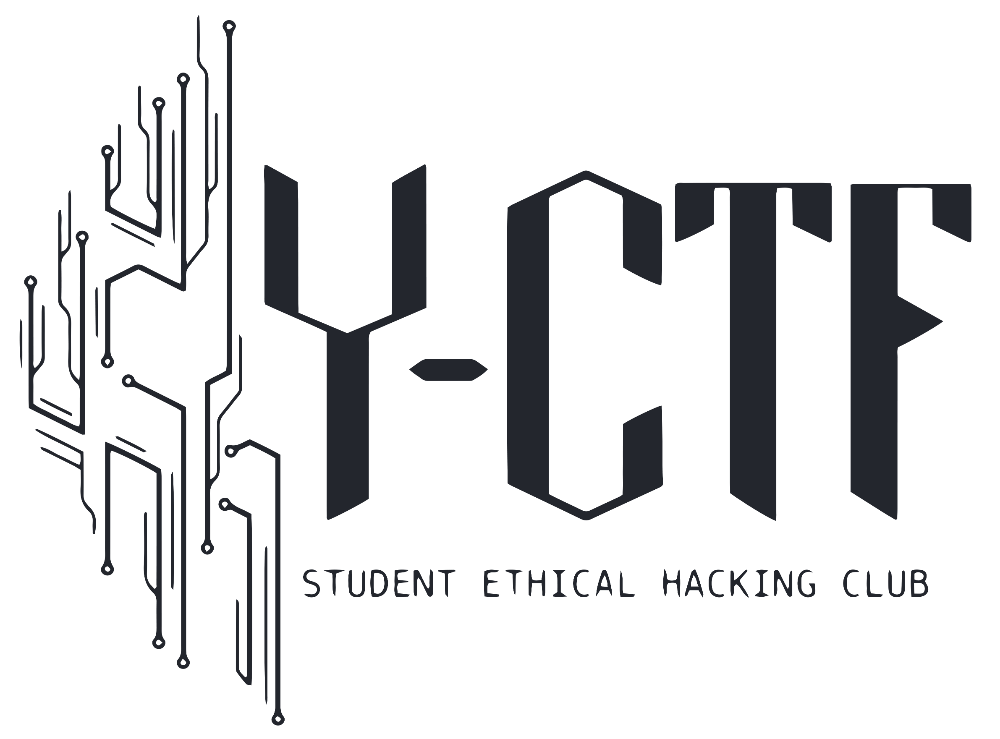

{:class="pres-image center"}

# À propos du club
{:#a-propos}

Le club Y-CTF est une association étudiante à but non lucratif créée en 2020 au sein de la HEIG-VD.

Son objectif est de promouvoir et introduire la sécurité informatique aux étudiants et étudiantes de l'école.

L'activité principale du club est de participer à des événements CTF en Suisse romande (Insomni'hack, Black Alps) et la participation régulière à des CTF en ligne.
Nous organisons également tout au long de l'année, selon les dispositions des membres et du comité, des présentations sur divers sujets liés au ethical hacking, des workshops ainsi que des entraînements de CTF.



# Inscription

Tous les étudiants de diplômés de la HEIG-VD sont admis dans le club CTF. Les personnes de tous les domaines d'études et de tout niveau en informatique sont les bienvenues.

L'inscription est annuelle, sans engagement de participation aux activités et il n'y a pas de cotisation à payer.

Rejoignez-nous via ce formulaire qui vous donnera ensuite accès au serveur Discord et au groupe Telegram du club: [Inscription](https://docs.google.com/forms/d/e/1FAIpQLSdQ3DWtiLpi9OEljdBpNflYOw4kBDGMT1cAW-Gn4Feg8isLUA/viewform?usp=sf_link)

 

En cas de question, n'hésitez pas à contacter le ou la responsable des membres (voir infos de contact à la fin).



# Séance d'information 

Une séance d'information sur le club et les futures activités aura lieu le jeudi 26 septembre à 12:15 dans la salle F01 à Cheseaux, rejoignez-nous !

# Qu'est-ce qu'un CTF ? 
{:#ctf}

CTF (pour Capture The Flag) est une discipline compétitive de sécurité informatique. Il consiste à mettre en pratique des techniques et outils dans le but résoudre des challenges de hacking et ainsi gagner des points dans le classement du CTF.

Il existe plusieurs catégories de challenges, représentant chacune un aspect de la sécurité informatique. On peut lister par exemple:

- Web : le but est de trouver une faille sur un site Internet et de l'exploiter pour obtenir le flag.
- Cryptanalyse : analyser un algorithme de cryptographie cassé afin de décrypter un message contenant un flag.
- Cracking et pwn : analyser le comportement d'un programme binaire avec du reverse engineering, et trouver des vulnérabilités à exploiter.
- Forensic : analyser des fichiers tels que des logs d'incidents, des fichiers PDF, ou autres type de fichiers qui pourraient être utiles en situation réelle lors de travail d'investigation suite à des piratages informatiques.
- OSINT : à partir d'informations données souvent énigmatiques, chercher sur Internet des traces de comptes suspects qui peuvent contenir le flag.
- Mobile : Des challenges le but est de cracker une application mobile Android.

Les compétitions de CTF se font souvent en ligne, et ont généralement lieu sur un ou deux jours. Des CTF sont organisés presque tous les week-ends par diverses organisations.

Le site CTF Time répertorie tous les CTF et récupère le classements de chacun d'eux pour établir un scoreboard global : [https://ctftime.org/](https://ctftime.org/)



## Par où commencer ?

Le CTF est une discipline très variée et qui peut être au premier abord intimidant pour les personnes sans expérience. Heureusement, on trouve beaucoup de ressources et d'outils pour s'entraîner. Par exemple ces deux sites qui proposent des challenges variés:

- [https://tryhackme.com/](https://tryhackme.com/)
- [https://www.root-me.org/](https://www.root-me.org/)

L'outil presque indispensable au CTF et à la sécu informatique est l'OS Kali Linux. C'est une distribution Linux créée pour le pentesting (audit de sécurité informatique) regroupant énormément d'outils et qui peut être installée dans une machine virtuelle. Il regroupe plein d'outils utiles pour le hacking : [https://www.kali.org/](https://www.kali.org/)

Un autre outil extrêmement utile au CTF est Cyberchef, qui regroupe différents outils de manipulation de texte et de fichier dans un seul site web : [https://gchq.github.io/CyberChef/](https://gchq.github.io/CyberChef/)

Nous avons créé une liste d'outils et ressources utiles pour les CTF, disponible [ici](https://docs.google.com/spreadsheets/d/1uePJ9nsLPX1dPAWzDEjnXoPl42vq4A-U-5ZiTY2R7DU/edit#gid=365690992&fvid=984731724). Tous les membres du club peuvent y contribuer via le salon Discord dédié.

Bien entendu, le but du club est la collaboration, alors n'hésitez pas à demander de l'aide via Discord !



# Activités et événements
{:#events}

Les activités sont annoncées sur Telegram. Vous trouverez un historique des CTF auquels nous avons participés sur le notre page [CTF Time](https://ctftime.org/team/120794). 

Nous proposons des participations aux CTF en ligne environ une fois par mois, et organisons occasionnellement des workshops. La fréquence des activités dépend beaucoup de la charge de travail du comité et des membres. Bien sûr, la participation à ces activités ne sont pas obligatoires.

 

Nous sommes ouverts à toutes les propositions d'activités et workshops !



# Plus d'infos
{:#contact}

## Logo

Merci à Eloïse Coderay qui a créé toutes les versions du logo Y-CTF. Nous vous encourageons vivement à aller voir son travail sur son compte Instagram: [@_une_pluie_d_etoiles_](https://www.instagram.com/_une_pluie_d_etoiles_/). Elle se fait connaître sous le pseudo Yukina.

## Comité 

Notre comité est formé d'étudiants bénévoles et d'un assistant (depuis Septembre 2024).

- Felix Breval, Président
- Aubry Mangold, Vice-Président
- Alexandre Shyshmarov, Trésorier et responsable de la communication
- Grégoire Rista, responsable des membres, infrastructure et matériel 

### Ancien comité

#### Comité 2023-2024

-  Anthony David, Président
-  Céline Roger, Vice-Présidente
-  Anthony Coke, Responsable membres, infrastructure, matériel & communication
-  Damien Maier, Trésorier
-  Axel Vallon, Assistant Y-Security

#### Comité 2022-2023

-  Anthony Coke, Président
-  Anthony David, Vice-Président et Responsable de l’infrastructure et du matériel
-  Céline Roger, Trésorier
-  Jean-François Pasche, Responsable de la communication
-  Eliott Chytil, Responsable des membres

#### Comité 2021-2022

- Ryan Sauge, Président
- Alexandra Cerottini, Vice-présidente et responsable de la communication
- Anthony David, Trésorier
- David Pellissier, Responsable des membres
- Léonard Besseau, Responsable de l’infrastructure et du matériel

#### Comité 2020-2021

- Julien Béguin, Président
- Ryan Sauge, Trésorier
- Laurent Thoeny, Responsable de la communication
- Tiffany Bonzon, Responsable des membres et du coaching
- Laurent Scherer, Responsable de l’infrastructure et du matériel,

#### Comité 2020

- Edin Mujkanovic, Président
- Daniel Oliveira Paiva, Trésorier
- Ryan Sauge, Responsable de la communication
- Victor Truan, Responsable des membres et du coaching
- Mickael Bonjour, Responsable de l’infrastructure et du matériel

## Statuts du club

Les statuts du club approuvés pendant la 1ère AG sont diponibles ici: [Statuts Club CTF-2022-final.pdf](/assets/pdf/Statuts Club CTF-2022-final.pdf)
